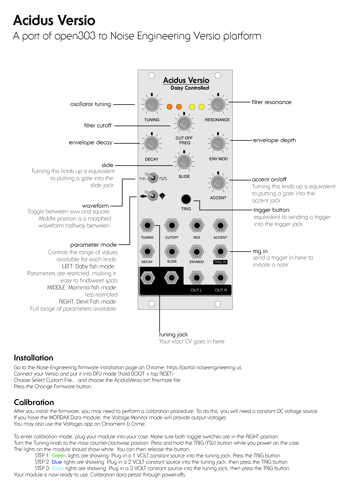

# Acidus Versio, a TB-303 emulator for the Noise Engineering Versio platform

This is a port of [Robin Schmidt's open303 code](https://github.com/RobinSchmidt/Open303). 

Read the full manual [here](docs/AcidusVersioManual.pdf)